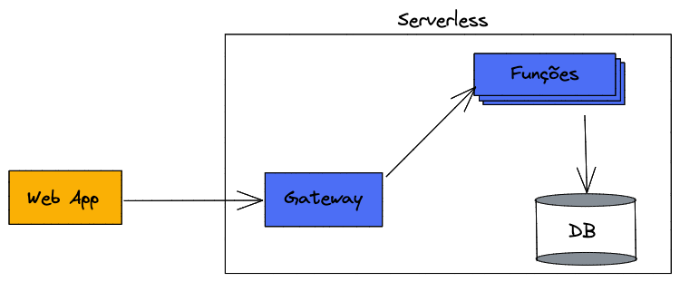
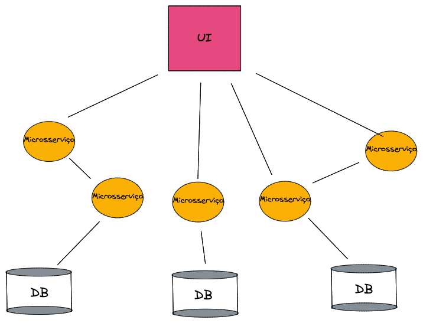

# Arquitetura e Design

## Arquitetura

É o processo de conversão de características como, flexibilidade, escalabilidade, resiliência, viabilidade, reutilização e segurança, que atenda as expectativas técnicas e principalmente de negócios/operacionais.

É responsável pelo esqueleto e infraestrutura de alto nível.

 

## Design

É responsável pelo design no nível de código, como, o que cada módulo está fazendo, escopo de classes e funções.

- clean code

- princípios de desenvolvimento

- padrões de projeto

 

## Características da Arquitetura de Software

### Extensível

Qualidade de ser projetado para permitir a adição de novos recursos ou funcionalidades, ou seja, ser personalizável. Ex: adição de plugins ou addons.

 

### Modular

É a decomposição em partes menores com interfaces padronizadas, ou seja, um módulo é um pedaço de código que pode ser reutilizado e combinado com outros módulos, ou até mesmo substituído.

 

### Interoperabilidade

É responsável pela sua operação e transmissão/troca de dados com outros sistemas externos. Para melhoras a interoperabilidade, é possível utilizar interfaces externas, sistemasa de padronização, etc.

 

### Sustentável

Com sustentável, pode se dizer que o software deve ser eficiente. Que fará a utilização dos recursos da melhor forma, levando em consideração o que tem disponível para execução.

 

### Performance

Resposta do sistema com base na execução de determinadas ações por um determinado período de tempo.

Maneiras de medir o desempenho:

- Latência: tempo gasto na resposta a um evento

- Capacidade do Canal: número de eventos que ocorrem em um determinado ponto no tempo

Quanto menor a latência, maior a performance...

 

### Escalabilidade

É a capacidade do sistema lidar com o aumento de carga sem d iminuir o desempenho, ou é a possibilidade de aumentar a carga de forma rápida.

Existem duas maneiras de melhorar a escalabilidade:

- Vertical (RECURSO): para aumentar, é necessário adicionar mais recursos, como memória, discos ou processadores de uma máquina/sistema
- Horizontal (UNIDADES): para aumentar, é necessário adicionar mais unidades de computação e dividir a carga entre elas

 

### Tolerância a Falhas

Refere-se a capacidade de um sistema continuar operando sem interrupção quando um ou mais de seus componentes falham, garantindo alta diponibilidade e continuidade de negócios. Sistemas tolerantes a falhas, utilizam componentes de backup, que substituem automaticamente os componentes com falha para que não haja perda de serviço.

 

### Segurança

É responsável pela capacidade do sistema reduzir a probabilidade de ações maliciosas ou acidentais, assim como a probabilidade de roubo ou perda de informações.

 

### Confiabilidade

É um atributo responsável pela capacidade de continuar operando sob condições predefinidas. Na maioria das vezes o sistema falha devido à inacessibilidade de elementos externos.

 

### Resiliência

É a capacidade de fornecer e manter um nível aceitável de serviço diante das falhas e desafios. Estas falhas podem variar de uma simples configuração incorreta, até grandes desastres naturais.

 

## Padrões de Arquitetura de Software

Disponibilidade ou modelo dos recursos/componentes disponíveis, assim como o relacionamento entre estes a fim de resolver um problema.

 

### Serverless

Refere-se a uma solução que depende de serviços de terceiros para gerenciar a complexidade dos servidores e o gerenciamento backend.

A arquitetura Serverless é dividida em duas categorias:

- backend como serviço (BaaS)

- funções como serviço (FaaS)

Ajuda a economizar tempo, já que não tem um backend para implementar, corrigir bugs ou fazer tarefas regulares de servidores.

O serviço mais famoso atualmente é o AWS Lambda.

 

### Event-driven

Depende de **Produtores de Eventos** e **Consumidores de Eventos**.

A ideia é desacoplar as partes do sistema onde cada parte será acionada quando um evento é produzido.

Eventos produtores são dependentes de alguma ação do usuário/tempo para ser produzido.

Os sistemas consumidores ficam escutando a eventos com base em um "tipo".

 

### Microsserviços

Depende do desenvolvimento de pequenos serviços ou módulos, que são independentes, onde, cada serviço/módulo resolve um problema específico ou executa uma única tarefa.

Esses módulos comunicam entre si por meio de uma API definida para atender o objetivo do negócio.

 

## Princípios de Desenvolvimento

- Domínio e IP: "google.com" é o mesmo que "12"

### SOLID

- **S**ingle Responsability: significa que cada classe deve ter um único propósito, uma responsabilidade e um motivo para mudar.

- **O**pen Closed: signiica que uma classe deve estar aberta para extensão e fechada para modificação. Em outras palavras, deve ser possível adicionar mais funcionalidades na classe, mas sem editar as funções atuais de uma forma que interrompa o código existente e que a utiliza.

- **L**iskov Substitution: orienta o desenvolvedor a utilizar herança de uma maneira que uma classe filha "B" herdar de uma classe pai "A", a classe filha não deve replicar uma funcionalidade da classe pai de forma a alterar o comportamento da classe pai. Assim elas se tornam independentes e não quebram a lógica da aplicação.

- **I**nterface Segregation: como uma classe pode implementar múltiplas interfaces, o código deve ser estruturado de uma forma que uma classe nunca seja forçada a implementar uma função que não seja importante para seu propósito.

- **D**ependency Inversion: se uma determinada classe "Purchase" depende da classe "User", então a instanciação do objeto User deve vir de fora da classe Purchase. A abstração não depende do detalhe, o detalhe que depende da abstração.

 

## Conceitos Básicos de Arquitetura

### DNS

O DNS fornece uma pesquisa por chave ou valor de um nome de domínio. Por exemplo, google.com para um endereço de IP 85.129.83.120, que é necessário para que o computador faça uma solicitação para o servidor.

Uma analogia com números de telefone, a diferença de um domínio e um endereço IP é a mesma diferença entre, "ligue para John Doe" e "ligue para 201-867-5309".

Assim como era necessário um catálogo telefônico para procurar o número de John Doe, é necessário o DNS para procurar o endereço IP de um domínio.

Então, dá para pensar no DNS como uma lista telefônica da internet.

 

### Load Balancer

Antes de entrar no load balancer, é relevante descatar o dimensionamento Horizontal x Vertical:

- horizontal: é dimensionado utilizando mais máquinas ao conjunto de recursos

- vertical: é dimensionado adicionando mais energia a uma máquina ou recurso existente como, CPU, RAM, etc

No desenvolvimento web, é preferível sempre escalar horizontalmente, pois as coisas quebram/falham. Os servidores travam aleatóriamente. As redes degradam. Data centers ficam offline.

Ter mais de um servidor permite planejar interrupções para que a aplicação continue em execução. Em outras palavras, ela se torna "tolerante a falhas".

Em segundo, o dimensionamento horizontal permite acoplar diferentes partes do backend (servidor, banco de dados, serviços, etc) fazendo com que cada uma delas seja executada em servidores diferentes.

Por fim, é possível chegar em uma escala onde não é mais possível verticalmente. Não há computador que seja grande o suficiente para realizar todos os cálculos da aplicação.

Agora sim, entrando nos load balancers, são eles que tornam o dimensionamento horizontal possível.

Eles roteiam as solicições de entrada para um dos muitos servidores da aplicação, que normalmente são clones/imagens espalhadas uns dos outros e enviam respostas para o cliente.

Qualquer um deles deve processar a solicitação da mesma maneira, então é apenas uma questão de distribuir as solicitações pelo conjunto de servidores para que nenhum deles fique sobrecarregado.

 

### Web Application Server

Executam a lógica de negócios principal, que trata da solicitação de um usuário e envia o HTML para o navegador do usuário.

Eles normalmente se comunicam com uma variedade de infra backend, como, banco de dados, camadas de cache, filas, serviços de pesquisa, outros microsserviços, etc...

Normalmenet há dois ou mais Web Application Servers conectados a um load balancer para processar as requisições do usuário.

Os servidores backend possuem uma linguagem específica (Node.js, Java, etc), e uma estrutura Web MVC para a linguagem (Express para o Node.js, Spring para o Java, etc).

 

### Database Servers

Toda aplicação moderna possui um ou mais bancos de dados para armazenar informações.

Os bancos de dados fornecem formas diferentes de definir sua estrutura, assim como, inserir, localizar, atualizar ou excluir dados,realizar cálculos, etc.

Na maioria dos casos, os servidores web, falam diretamente com o banco de dados. Além disso, cada serviço backend pode ter seu próprio banco de dados isolado do restante da aplicação.

Existem bancos de dados SQL e NoSQL:

- SQL: significa "Structured Query Languagem", e fornece uma maneira de consultar um conjunto de dados relacionais. Os bancos de dados SQL, armazenam seus dados em tabelas, vinculadas por meio de IDs comuns.
- NoSQL: significa "non-SQL", e é um conjunto que surgiu para lidar com grandes quantidades de dados, que podem ser produzidas por aplicações de grande escala.

 

### Caching Service

Fornece um armazenamento de dados de chave/valor que possibilita salvar e pesquisar infomações em um tempo próximo de O(1).

As aplicações aproveitam o serviço de cache para salvar os resultados de cálculos complexos, de modo que seja possível recuperar o valor sem ter que recalcular da próxima vez que forem necessários.

Uma aplicação pode salvar no cache resultados como:

- consulta do banco de dados
- chamadas para serviços externos

 

### Job Queue e Servers

A maioria das aplicações web precisam fazer algum trabalho assíncrono nos bastidos, que ão está associado diretamente a ação de um usuário.

Por exemplo, o Google precisa rastrear e indexar toda a internet para retornar os resultados da pesquisa. Ele não faz isso toda vez que pesquisamos, ele rastreia a web de forma assínrona, atualizando os índices de pesquisa gradualmente.

Embora existam diferentes arquiteturas que permitam a realização de trabalho assíncrono, a mais comum é a "fila de tarefas".

Consiste de dois componentes:

- job queue: lista que precisa ser executada em um ou mais servidores de trabalho

- workers: executam os trabalhos da fila

 

### Full-text Search Service

Muitos das aplicações web suportam algum tipo de recurso de pesquisa, em que um usuário fornece uma entrada de texto, geralmente chamada "consulta", e a aplicação retorna os mais "relevantes".

A tecnologia que alimenta essa funcionalidade é normalmente chamada de "full-text search", que aproveita um índice invertido para pesquisar rapidamente, documentos que contenham as palavras-chaves da consulta.

Embora seja possível fazer essa consulta de texto diretamente no banco de dados, a plataforma mais popular é o Elasticsearch.

 

### Services

Quando uma aplicação atinge uma certa escala, provavelmente haverão "serviços" criados para serem executados como aplicações separadas.

Essas não podem ser expostas ao mundo externo, mas a aplicação e outros serviços interagem com estas.

Alguns serviços:

- Service Account: armazena dados do usuário

- Content Service: armazena meta dados do conteúdo exibido

- Payment Service: frnece uma interface para cobranca de cartões de crédito

- HTML -> PDF Service: fornece uma interface que aceita HTML e retorna um PDF correspondente

entre outros...

 

### Data

Empresas vivem e morrem com base em quão bem aproveitam os dados.

Quase toda aplicação, quando atingem uma escala, aproveitam um pipeline de dados para que os dados possam ser coletados, armazenados e analisados. Um pipeline comum tem três estágios principais:

1. O app envia dados, geralmente eventos sobre interações do usuário para o "firehose" de dados. Os dados brutos normalmente são transformados e passados para outro firehose. O AWS Kinesis e Kafka são os mais comuns para esta finalidade.

2. Os dados brutos e transformados são salvos no armazenamento em nuvem. O AWS Kinesis fornece uma configuração fácil para salvar estes dados.

3. Os dados são carregados em um data warehouse para análise. O AWS Redshift é um serviço bem comum.

 

### Cloud Storage

É a maneira mais simples e escalável de armazenar, acessar e compartilhar dados pela internet.

É possível interagig com ele por meio de uma API REST.

O Amazon S3 é o armazenamento mais popular disponível hoje, e é nele que são armazenados os estáticos como, imagens, CSS e JavaScript, etc...

 

### CDN

Significa "Content Delivery Network", fornece uma maneira de servir ativos como HTML estático, CSS, JavaScript e imagens pela web muito mais rápido do que servi-los a partir de um único servidor de origem.

Funciona distribuindo o conteúdo em muitos servidores ao redor do mundo, para que os usuários, dependendo de sua localização, baixem o conteúdo destes servidores mais próximos e não apenas do servidor de origem.

Causando:

- maior distâcia da conectividade

- aumento na latência

- aumento do tempo de carregamento

O CDN visa solucionar os problemas citados acima.

 

## Referências

https://github.com/donnemartin/system-design-primer#performance-vs-scalability

https://codeburst.io/software-architecture-the-difference-between-architecture-and-design-7936abdd5830

https://medium.com/storyblocks-engineering/web-architecture-101-a3224e126947

https://hackernoon.com/quality-attributes-in-software-architecture-3844ea482732
